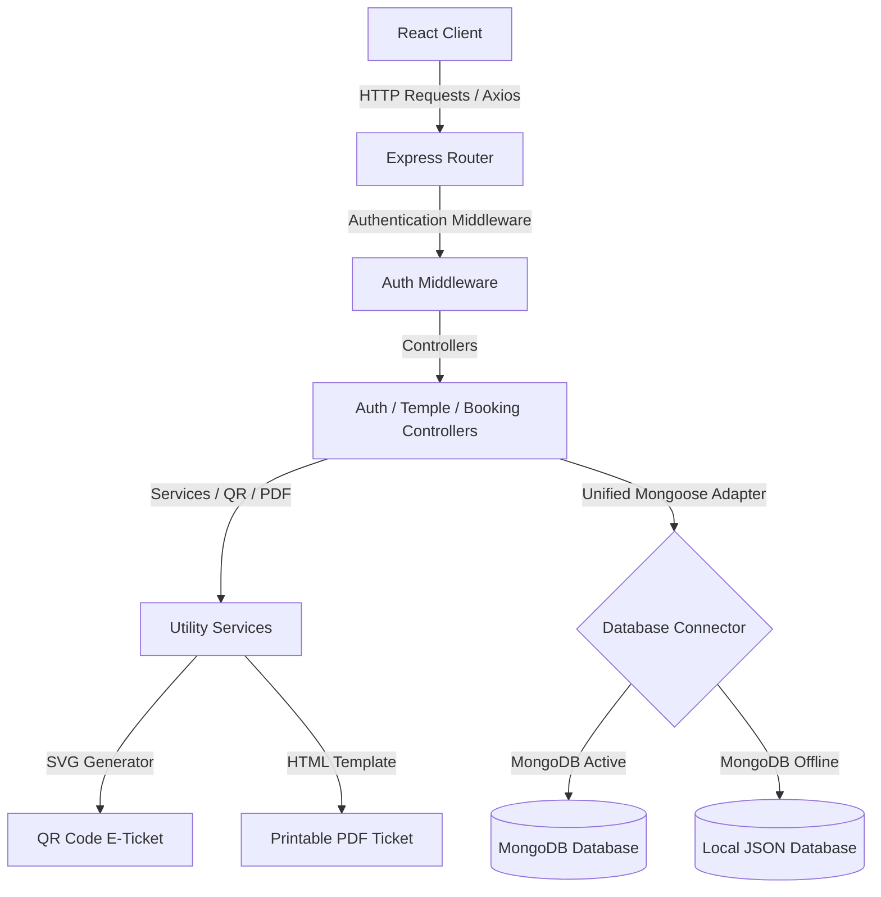

# DarshanEase – Technical Documentation

This document provides a comprehensive overview of the architecture, database models, security mechanisms, API routes, and components of the **DarshanEase** Smart Temple Darshan Ticket Booking platform.

---

## 🏛️ System Architecture

DarshanEase is designed using the standard **MVC (Model-View-Controller)** pattern. Below is a high-level representation of the request flow and component interactions:

---

## 🔑 Security & Authentication Model

The application enforces role-based security using JSON Web Tokens (JWT) and Bcrypt encryption.

### 1. Password Protection
*   Passwords are encrypted during registration using `bcryptjs` with a salt factor of `10`.
*   During login, input credentials are verified using `bcrypt.compare()`.

### 2. Token Management
*   **Access Token**: A short-lived token (`expiresIn: '15m'`) carrying user details (ID, Email, Role) injected into HTTP request headers (`Authorization: Bearer <token>`).
*   **Refresh Token**: A long-lived token (`expiresIn: '7d'`) stored in the browser's `localStorage` and database, used to acquire new access tokens seamlessly without logging the user out.

### 3. Role-Based Middleware
The server uses middleware check-functions to restrict routes:
*   `verifyToken`: Parses headers, verifies JWT signature, and attaches `req.user`.
*   `authorizeRoles('ADMIN', 'ORGANIZER')`: Rejects requests with `403 Forbidden` if the authenticated user's role does not match.

---

## 🗄️ Database Schema Design

The data layer uses Mongoose models equipped with an adaptive JSON-file fallback layer.

### 1. Users Collection
Stores account details for devotees, organizers, and admins.
*   `name` (String, Required)
*   `email` (String, Required, Unique)
*   `phone` (String, Required)
*   `password` (String, Required)
*   `role` (String, Enum: `USER`, `ORGANIZER`, `ADMIN`, Default: `USER`)
*   `profileImage` (String, Default: `""`)
*   `address` (String, Default: `""`)
*   `createdAt` (Date, Default: `Date.now`)

### 2. Temples Collection
Stores descriptive content for holy shrines.
*   `name` (String, Required)
*   `location` (String, Required)
*   `district` (String, Required)
*   `state` (String, Required)
*   `description` (String, Required)
*   `history` (String, Default: `""`)
*   `image` (String, Required banner URL)
*   `gallery` (Array of Strings)
*   `openingTime` (String, Required)
*   `closingTime` (String, Required)
*   `specialDarshan` (Array of Strings)
*   `facilities` (Array of Strings)
*   `latitude` (Number, Default: `0`)
*   `longitude` (Number, Default: `0`)

### 3. DarshanSlots Collection
Represents time-bounded entries for specific dates.
*   `templeId` (ObjectId, Reference: `Temple`, Required)
*   `date` (String, Format: `YYYY-MM-DD`, Required)
*   `time` (String, Format: `HH:MM AM - HH:MM PM`, Required)
*   `capacity` (Number, Required)
*   `availableSeats` (Number, Required)
*   `price` (Number, Default: `0`)
*   `status` (String, Enum: `Active`, `Cancelled`, `Full`, Default: `Active`)

### 4. Bookings Collection
Represents devotee slot confirmations.
*   `bookingId` (String, Unique index format: `DE-YYYYMMDD-RAND`)
*   `userId` (ObjectId, Reference: `User`, Required)
*   `templeId` (ObjectId, Reference: `Temple`, Required)
*   `slotId` (ObjectId, Reference: `DarshanSlot`, Required)
*   `persons` (Array of Passenger subdocuments: `{ name: String, age: Number, gender: String }`)
*   `totalAmount` (Number, Required)
*   `bookingStatus` (String, Enum: `Pending`, `Confirmed`, `Cancelled`, Default: `Confirmed`)
*   `paymentStatus` (String, Enum: `Pending`, `Paid`, `Failed`, `Refunded`, Default: `Paid`)
*   `ticketQRCode` (String, Base64 SVG Data URL)
*   `createdAt` (Date, Default: `Date.now`)

### 5. Donations Collection
Tracks devotee charitable transactions.
*   `userId` (ObjectId, Reference: `User`, Required)
*   `templeId` (ObjectId, Reference: `Temple`, Required)
*   `amount` (Number, Required)
*   `paymentMethod` (String, Enum: `UPI`, `Credit Card`, `Debit Card`, `Net Banking`, `Wallet`)
*   `transactionId` (String, Format: `TXN-RAND`)
*   `date` (Date, Default: `Date.now`)

---

## 📡 API Route Reference

### 1. Authentication Router (`/api/auth`)

| Method | Endpoint | Auth Required | Description | Request Body Example |
| :--- | :--- | :--- | :--- | :--- |
| **POST** | `/register` | Public | Register new user account | `{ "name": "...", "email": "...", "phone": "...", "password": "...", "role": "USER" }` |
| **POST** | `/login` | Public | Login credentials, generate tokens | `{ "email": "...", "password": "...", "rememberMe": true }` |
| **POST** | `/refresh-token` | Public | Refresh expired access tokens | `{ "token": "refresh_token_string" }` |
| **POST** | `/forgot-password`| Public | Request simulated reset code | `{ "email": "devotee@example.com" }` |
| **POST** | `/reset-password` | Public | Reset password using the code | `{ "email": "...", "resetCode": "123456", "newPassword": "..." }` |
| **GET** | `/profile` | Devotee/Admin | Retrieve current profile details | *None* |
| **PUT** | `/profile` | Devotee/Admin | Edit address, name, or phone | `{ "name": "New Name", "phone": "..." }` |

### 2. Temples Router (`/api/temples`)

| Method | Endpoint | Auth Required | Description | Request Parameters |
| :--- | :--- | :--- | :--- | :--- |
| **GET** | `/` | Public | Get temples with optional search/state filter | Query parameters: `?search=Kedar&state=Uttarakhand` |
| **GET** | `/:id` | Public | Get specific temple details | Path: `id` (Temple Document ID) |
| **POST** | `/` | Admin Only | Add a new temple | Multipart Form-Data (including banner file) |
| **PUT** | `/:id` | Admin Only | Edit temple parameters | Multipart Form-Data |
| **DELETE** | `/:id` | Admin Only | Remove temple and slots | Path: `id` |

### 3. Slots Router (`/api/slots`)

| Method | Endpoint | Auth Required | Description | Request Parameters |
| :--- | :--- | :--- | :--- | :--- |
| **GET** | `/temple/:templeId`| Public | Fetch slots for date/temple | Path: `templeId`, Query: `?date=YYYY-MM-DD` |
| **POST** | `/` | Organizer/Admin | Schedule a new time slot | `{ "templeId": "...", "date": "YYYY-MM-DD", "time": "...", "capacity": 50, "price": 150 }` |
| **DELETE** | `/:id` | Organizer/Admin | Delete a time slot | Path: `id` (Slot ID) |

### 4. Bookings Router (`/api/bookings`)

| Method | Endpoint | Auth Required | Description | Request Parameters / Body |
| :--- | :--- | :--- | :--- | :--- |
| **POST** | `/` | Devotee Only | Confirm slot checkout & buy tickets | `{ "templeId": "...", "slotId": "...", "persons": [{ "name": "...", "age": 25, "gender": "Male" }], "paymentMethod": "UPI" }` |
| **GET** | `/my-bookings`| Devotee Only | Retrieve devotee booking history | *None* (Fetched using request token details) |
| **PUT** | `/:id/cancel` | Devotee Only | Cancel booking & restore slot seats | Path: `id` (Booking Document ID) |
| **GET** | `/ticket/:bookingId`| Public | Load printable ticket HTML layout | Path: `bookingId` (DE-YYYYMMDD-RAND format) |
| **POST** | `/verify-qr` | Organizer/Admin | Validate QR code value at entrance | `{ "bookingId": "DE-20260715-9995" }` |

---

## 💻 Frontend Routing Structure

The React application uses **React Router DOM v6** for view management.

### Public Routes
*   `/` -> [LandingPage.jsx](file:///C:/Users/ADMIN/.gemini/antigravity-ide/scratch/darshanease/client/src/pages/LandingPage.jsx) (Hero banner, popular temple grids, steps, upcoming festivals)
*   `/login` -> [Login.jsx](file:///C:/Users/ADMIN/.gemini/antigravity-ide/client/src/pages/Login.jsx) (Glassmorphic login card)
*   `/signup` -> [Signup.jsx](file:///C:/Users/ADMIN/.gemini/antigravity-ide/client/src/pages/Signup.jsx) (Devotee or Organizer registration)
*   `/forgot-password` -> [ForgotPassword.jsx](file:///C:/Users/ADMIN/.gemini/antigravity-ide/client/src/pages/ForgotPassword.jsx)
*   `/reset-password` -> [ResetPassword.jsx](file:///C:/Users/ADMIN/.gemini/antigravity-ide/client/src/pages/ResetPassword.jsx)
*   `/temples` -> [TempleListing.jsx](file:///C:/Users/ADMIN/.gemini/antigravity-ide/client/src/pages/TempleListing.jsx) (Search results, sidebar filter pane)
*   `/temples/:id` -> [TempleDetails.jsx](file:///C:/Users/ADMIN/.gemini/antigravity-ide/client/src/pages/TempleDetails.jsx) (Temple description, history, reviews list, slot check redirects)

### Protected Routes (Devotees)
*   `/temples/:templeId/slots` -> [SlotSelection.jsx](file:///C:/Users/ADMIN/.gemini/antigravity-ide/client/src/pages/SlotSelection.jsx) (Visual time slot grid selection)
*   `/temples/:templeId/book` -> [BookingPage.jsx](file:///C:/Users/ADMIN/.gemini/antigravity-ide/client/src/pages/BookingPage.jsx) (Pilgrim details configuration cards)
*   `/temples/:templeId/payment` -> [PaymentPage.jsx](file:///C:/Users/ADMIN/.gemini/antigravity-ide/client/src/pages/PaymentPage.jsx) (Interactive transaction choice)
*   `/temples/:templeId/success` -> [BookingSuccess.jsx](file:///C:/Users/ADMIN/.gemini/antigravity-ide/client/src/pages/BookingSuccess.jsx) (Confirmation checklist and print triggers)
*   `/profile` -> [Profile.jsx](file:///C:/Users/ADMIN/.gemini/antigravity-ide/client/src/pages/Profile.jsx) (Devotee control center containing tabs for bookings list, donations log, and details updates)
*   `/notifications` -> [Notifications.jsx](file:///C:/Users/ADMIN/.gemini/antigravity-ide/client/src/pages/Notifications.jsx) (User alert log list)

### Protected Routes (Admin/Organizer Panel)
*   `/admin` & `/organizer` -> [AdminDashboard.jsx](file:///C:/Users/ADMIN/.gemini/antigravity-ide/client/src/pages/AdminDashboard.jsx) (Metrics overview cards and monthly bar charts)
*   `/admin/temples` -> [AdminTempleManagement.jsx](file:///C:/Users/ADMIN/.gemini/antigravity-ide/client/src/pages/AdminTempleManagement.jsx) (Temple CRUD table and form popups)
*   `/admin/slots` & `/organizer/slots` -> [AdminSlotManagement.jsx](file:///C:/Users/ADMIN/.gemini/antigravity-ide/client/src/pages/AdminSlotManagement.jsx) (Slot list calendar)
*   `/admin/bookings` -> [AdminBookingManagement.jsx](file:///C:/Users/ADMIN/.gemini/antigravity-ide/client/src/pages/AdminBookingManagement.jsx) (Complete transactions register and **QR Verification entrance gate**)
*   `/admin/users` -> [AdminUserManagement.jsx](file:///C:/Users/ADMIN/.gemini/antigravity-ide/client/src/pages/AdminUserManagement.jsx) (Role select panels and delete commands)
