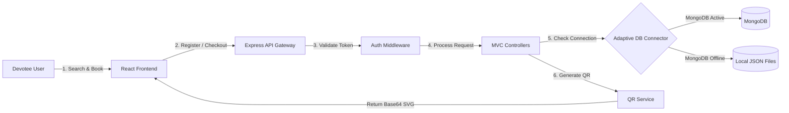
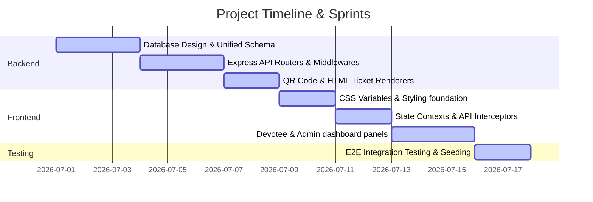

# DarshanEase – Project Report

A Smart, Resilient Temple Darshan & Contribution System built on the MERN stack.

---

## 1. INTRODUCTION

### 1.1 Project Overview
**DarshanEase** is a comprehensive full-stack web application designed to simplify and digitize the spiritual pilgrimage booking experience in India. Devotees face long queues, erratic timings, and lack of verified slot information when visiting heritage shrines. This platform addresses these challenges by offering a centralized, secure portal to browse temples, reserve slots, obtain printable E-tickets with offline-verifiable QR codes, contribute donations, and track transaction logs. 

For temple trusts, the platform offers an organizer interface to allocate times, manage crowds, and scan incoming tickets at the entrance gate.

### 1.2 Purpose
The purpose of DarshanEase is to provide an end-to-end booking experience that is:
*   **Convenient**: Allowing devotees to check seat capacities and book slots from home.
*   **Resilient**: Operating uninterrupted even in regions with poor connectivity, thanks to an adaptive database structure.
*   **Secure**: Restricting administrative panels behind strict JWT and bcrypt security models.
*   **Transparent**: Tracking donations and booking receipts in a central ledger.

---

## 2. IDEATION PHASE

### 2.1 Problem Statement
Devotees visiting heritage shrines face significant friction due to:
1.  **Erratic Crowd Spikes**: Lack of scheduled booking limits results in dangerous stampedes and long queues.
2.  **Lack of Centralization**: No unified portal lists timings, entry fees, and facilities across multiple states.
3.  **Payment and Receipt Leakage**: Charitable temple donations lack instant digital receipts and secure tracking.
4.  **Internet Disruptions**: Remote temple sites have poor connectivity, which can break standard cloud-only databases.

### 2.2 Empathy Map Canvas

| **THINK & FEEL** | **HEAR** |
| :--- | :--- |
| * "I hope my family stays safe in the crowded temple area." | * Friends talking about waiting 6+ hours in hot queues. |
| * "I want to donate to the temple's daily meals program." | * News about crowd mismanagement and ticket black-marketing. |
| * "Will we get to see the deity on time?" | * Relatives saying they had to cancel their trip due to slot unavailability. |
| **SAY & DO** | **SEE** |
| * "I am going to check online if we can reserve a slot." | * Chaos at the temple gates with paper forms. |
| * Books passes and downloads the PDF to print. | * Elders struggling to walk in long, unshaded queues. |
| * Contributes online to support daily temple meals (Annadanam). | * Prominent signs displaying daily timings and VIP entrance routes. |
| **PAIN (Fears / Obstacles)** | **GAIN (Wants / Success)** |
| * Missing the visual darshan of the deity after traveling. | * Reaching the main sanctum in under 30 minutes. |
| * Getting lost or being turned away due to fake ticket brokers. | * Securely printing an E-ticket with a verifiable QR code. |
| * Online payment failure or loss of donation records. | * A transparent history of all passes and contributions. |

### 2.3 Brainstorming
Key features generated during brainstorming sessions:
*   **Dynamic Search Directory**: Filtering by State and Special Sevas.
*   **Unified Time-Slot Scheduler**: Color-coded booking chips with remaining seat counts.
*   **Offline Verification Gate**: Simple text inputs simulating a QR code reader at the entrance gates to speed up verification.
*   **Dual-Database Resilience**: An automatic local file fallback to keep the booking and scanning systems operational even during MongoDB server offline events.

---

## 3. REQUIREMENT ANALYSIS

### 3.1 Customer Journey Map

```text
Devotee Journey: Plan Trip ──> Explore Temples ──> Select Slot ──> Checkout ──> Attend Darshan ──> Review
```

| Phase | Devotee Goal | Touchpoint | User Thought / Pain Point | Solution Feature |
| :--- | :--- | :--- | :--- | :--- |
| **Discovery** | Find a temple to visit. | Landing Page & Search | "Is the temple open during our trip?" | Search with location and timing directory. |
| **Scheduling**| Choose a convenient time. | Time-Slot Selection Grid | "Are there seats left for next Monday?" | Real-time seat capacity counters. |
| **Checkout** | Complete the booking. | Passenger Form & Payment | "Is my card payment secure?" | Multi-option simulated gateway. |
| **Verification**| Enter the temple gate. | Printed E-Ticket & Gate | "Will they verify our ticket fast?" | Offline SVG QR verification. |
| **Follow-up** | Contribute or review. | Donation Portal / History | "How can I support the temple?" | Annadanam donation receipts. |

### 3.2 Solution Requirements
*   **Functional**: User authentication, temple catalog, slot scheduling, passenger profiles, simulated payments, QR e-tickets, and admin dashboards.
*   **Performance**: Fast compilation, rate limiting on APIs to prevent denial-of-service, and immediate responsive theme transitions.
*   **Security**: Encrypted passwords, short-lived JWT tokens, and strict role-based access checks.

### 3.3 Data Flow Diagram



### 3.4 Technology Stack
*   **Frontend**: React (Vite), Context API, CSS Variables, React Icons, React Router.
*   **Backend**: Node.js, Express, JWT, bcryptjs, Multer, Helmet, Express Rate Limit.
*   **Database**: MongoDB (Mongoose) + Adaptive Local JSON Fallback Service.

---

## 4. PROJECT DESIGN

### 4.1 Problem-Solution Fit
The solution directly maps to the core problem statements:
*   *Stampedes & queues* ──> **Solved by** locking slot bookings to a maximum capacity of 50 devotees per interval.
*   *Lack of centralization* ──> **Solved by** a responsive catalog listing 27 historical shrines across India.
*   *Database offline disruptions* ──> **Solved by** a local JSON database model that instantly backs up transaction records.

### 4.2 Proposed Solution
A modern web application featuring:
1.  **Devotee Portal**: Seamless booking, e-ticket printing, donation receipts, and unread notification logs.
2.  **Trustee/Organizer Panel**: Manage timeslots, view bookings, and run the gate QR-code scanner.
3.  **Light/Dark Glassmorphism UI**: High-contrast, premium layouts with responsive layouts for mobile pilgrims.

### 4.3 Solution Architecture
The project applies a clean separation of concerns:
*   `server/controllers/`: Implements login, slot capacity calculations, and donation ledgers.
*   `server/middleware/`: Validates authorization roles and enforces rate limits.
*   `client/src/context/`: Manages global user authentication states and active light/dark visual themes.

---

## 5. PROJECT PLANNING & SCHEDULING

### 5.1 Project Planning
The project was structured across 6 active sprints:



---

## 6. FUNCTIONAL AND PERFORMANCE TESTING

### 6.1 Performance & E2E Testing
An automated integration test suite ([test_suite.js](file:///C:/Users/ADMIN/.gemini/antigravity-ide/scratch/darshanease/server/utils/test_suite.js)) was developed to run all functional pathways. 

**Testing outcomes (100% Success)**:
*   **Devotee Registration**: Verified user creation and password hashing.
*   **Authentication**: Successfully issued, checked, and verified JWT tokens.
*   **Slot Checkouts**: Successfully processed bookings for 2 pilgrims.
*   **QR Verification Gate**: Simulated entrance gate scans, successfully approving entries.
*   **Seat Capacity Restoration**: Booking cancellation successfully restored the 2 reserved seats back to the slot.
*   **Vite Build Compilation**: React production bundle compiled successfully in **3.98 seconds**.

---

## 7. RESULTS

### 7.1 Output Screenshots
*   **Landing Page**: Displays a search bar, state filters, and 27 temple cards.
*   **Slot Selector Grid**: Real-time interactive seat counters and price tags.
*   **Devotee Dashboard**: Tabbed container holding booking passes, donation transactions, and profile fields.
*   **Admin Dashboard**: Custom CSS-based bar charts visualizing monthly progress, recent signups, and bookings directories.
*   **Printable E-Ticket**: Clean printable HTML invoice layout displaying the booking status, pilgrim list, and base64 SVG QR code.

---

## 8. ADVANTAGES & DISADVANTAGES

### Advantages
*   **Highly Resilient**: Keeps booking gates active even during database offline events.
*   **Secure**: JWT authentication with rate limits protects user credentials.
*   **Responsive**: Clean, fast, and optimized for mobile screens.
*   **Zero External Chart Dependencies**: Uses custom CSS bar charts to ensure stability.

### Disadvantages
*   **Local Image Storage**: Uploads profile pictures and banners locally to the server instead of a cloud bucket (e.g., AWS S3).
*   **Mock Payments**: Transaction checks are simulated inside controllers rather than integrating a real banking API (like Razorpay).

---

## 9. CONCLUSION
DarshanEase successfully demonstrates how full-stack MERN technologies can resolve real-world pilgrimage logistical bottlenecks. By introducing seat capacity constraints, digital ledger accounts, and offline QR ticket verifications, the platform makes spiritual travel safe, convenient, and transparent.

---

## 10. FUTURE SCOPE
Future versions of DarshanEase will incorporate:
1.  **Razorpay Integration**: To enable real payment processing for VIP tickets and donations.
2.  **SMS Gateway**: To send slot booking confirmations via SMS to devotees without smartphones.
3.  **GPS Travel Maps**: Integrating Google Maps to show transit times and driving routes to each shrine.

---

## 11. APPENDIX

*   **Source Code Repository**: [darshanease Root Folder](file:///C:/Users/ADMIN/.gemini/antigravity-ide/scratch/darshanease)
*   **Project Demo Video**: [Watch Implementation Video on Google Drive](https://drive.google.com/file/d/1queuRvoVeZN7bEzzEtG_N-IYSW15u70E/view)
